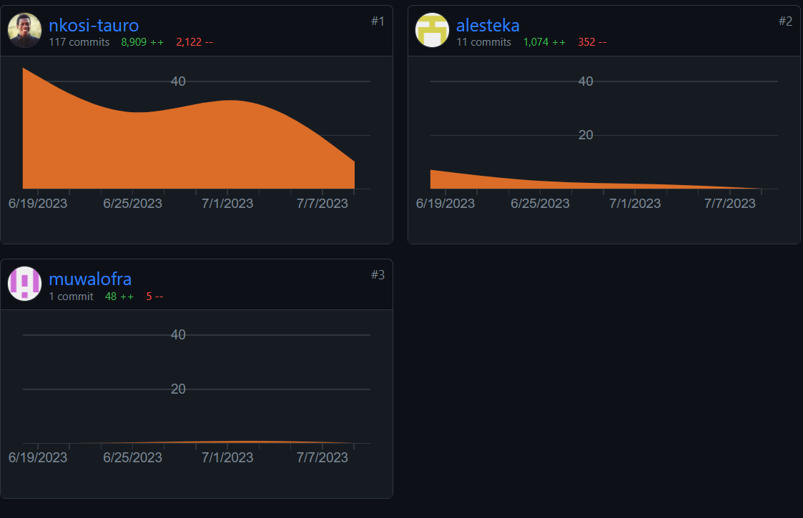

## Table of Contents
- [Assignment Brief](#assignment-brief) 
- [Evaluation](#evaluation)
- [Reflection](#reflection)
- [Team Collaboration](#team-collaboration)

## [Assignment Brief](#assignment-brief) 
Carrying on from the Full Brief provided in [Assignment 1](/eportfolio/module_ssd/assignment1.html), this assignment focuses on the second deliverable, a practical development of your design from [Assignment 1](/eportfolio/module_ssd/assignment1.html). 

Submission Checklist
- You should submit a fully tested set of code with all required libraries. Code should be well documented with in-line commentary.
- You should supply evidence of execution, demonstrating how key aspects of your code work (via demos, screenshots and output captures).
- You should include comprehensive evidence of testing including output from test tools (such as linters, etc.) demonstrating correct code, security and functional testing with any remediation activity documented as well.
- You should submit a README file that documents how the application runs.
- You should also be prepared to give regular demonstrations of: 
  - Code and executables.
  - Testing.
  - Demonstrations of development over the lifetime of the module (these may happen in the seminar sessions or in one-to-one sessions with your tutor).
  - A final session that demonstrates the functionality of the application that will be submitted, demonstrating as much functionality as possible and drawing attention to key operations and code.

You can view the Project Code here: [Dutch Forensics Reporting System Code](https://github.com/nkosi-tauro/dfrs_domain)   
You can view the Live Project here: [Dutch Forensics Reporting System Live](https://dfrsdomain-production.up.railway.app/)   
The Final Presentation with the Tutor was held on July 13, 2023

## [Evaluation](#evaluation)
- Final project (Unit 11) vs. the design proposal (Unit 6).

The Final project did not stray too far from what we had proposed, I'm pleased to state we implemented _all_ the features we had proposed with some new additions.

New Features include:
- Cache Microservice
- Ability to mark reports as fixed
- Email Service
- Rate limiter

### Architectural Differences.
In the original design proposal, the architectural plan included three microservices: Frontend, Backend (consisting of various services), and Database microservices. However, in the final project, the architecture shifted to a Full-Stack approach, combining the Frontend and Backend into a single service. This decision was made based on the capabilities of Django, which can function as a Backend API or a full framework that includes a Templating Engine for Frontend views. As a result, there was no need to split the Frontend into its own microservice.

The three microservices in the final architecture include the Full-Stack service, which combines the Frontend and Backend functionalities, the PostgreSQL Database service, and the Redis Cache service. The choice to use PostgreSQL as the database was driven by the need for persistent data storage in a microservice-based deployment, which was not feasible with SQLite. Additionally, the logging library was changed from the python logging module to the Event Logger module for Django, as it provided seamless integration with the project's database.

Overall, the final architecture maintained the use of microservices but made adjustments based on the specific requirements and capabilities of the technologies employed, ensuring efficient and effective implementation of the proposed features.

## [Reflection](#reflection)
Working on this project was a fascinating experience. One of the most fascinating aspects was the team's decision to use the Django Framework, a popular Python web framework, which none of us had prior experience with. This presented a valuable learning opportunity for everyone involved. Translating our design proposal into actual code required careful planning and consideration. We divided the initial tasks among team members, and I took on the responsibility of implementing the base project, including setting up the database and deployment pipelines on GitHub for source control and implementing the Admin View and CRUD functionality. Other team members had their assigned features, such as Employee View and CRUD functionality for Ales, and implementing the reporting form model for Francis and Abdul was to implement the Public view where the reporting form would be visible.

However, it became evident that there was an overreliance on Ales and me to ship and build features. The issues I had previously highlighted in my reflection on [Assignment 1](/eportfolio/module_ssd/assignment1.html) were still present in this project. I acknowledge that my failure to address these issues within the team may have exacerbated the problem. Nonetheless, I did offer assistance to any team members who were struggling, and Francis took up the offer, allowing us to successfully incorporate the reporting form model into the project. Despite these challenges, we managed to deliver the project on time.

Overall, this project served as a valuable learning experience, particularly in regard to adopting new technologies and collaborating effectively within a team. It highlighted the importance of proactive distribution of tasks, equal participation, and addressing issues early on to ensure a more balanced workload and successful project completion. In future projects, I will strive to address any imbalances in responsibilities promptly and foster an environment where all team members can actively contribute their skills and expertise.

## [Team Collaboration](#team-collaboration)
For effective collaboration, our team made effective use of GitHub as soon as the project commenced. We utilized GitHub to store the repository and employed Git for source control. This decision proved to be instrumental in ensuring efficient collaboration within our distributed team. Furthermore, GitHub's features enabled us to track the contributions made by each team member effectively. To provide visual evidence of our collaborative efforts, I have included the commit/contribution graph from GitHub below:

  

By leveraging GitHub and its features, we were able to maintain a well-organized and synchronized workflow. The ability to track changes, merge contributions, and address conflicts efficiently greatly facilitated our collaboration. Additionally, GitHub's version control system provided a safety net, allowing us to revert to previous versions of the code if needed.  

View More here:  
[Repository](https://github.com/nkosi-tauro/dfrs_domain)   
[Contributions](https://github.com/nkosi-tauro/dfrs_domain/graphs/contributors)