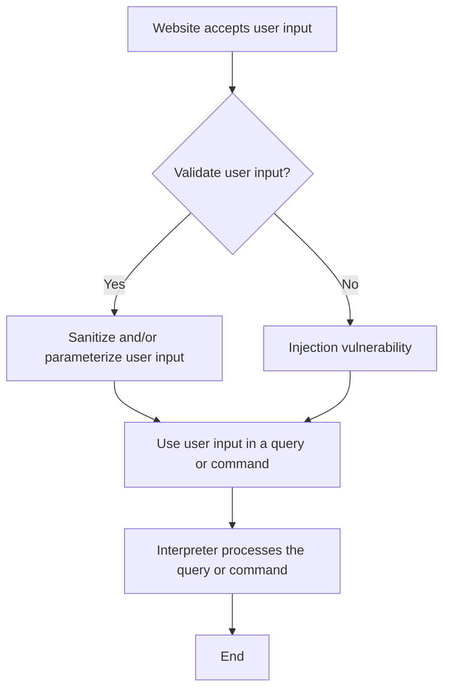
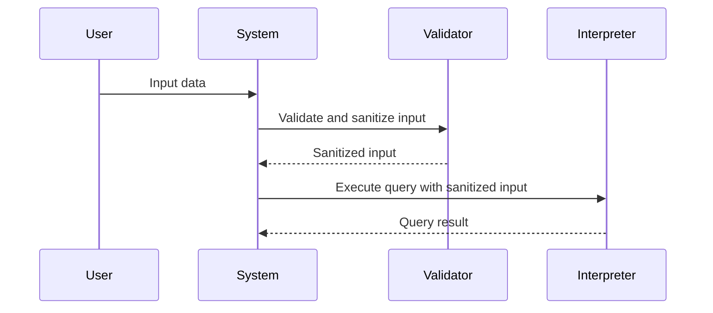

### Discussion Topic: 
Select one of the coding weaknesses which have been identified by OWASP and create a flowchart of the steps which may have led to the weakness occurring.    
 

**Initial Post**  
I have chosen the "Injection" weakness, which is one of the top vulnerabilities identified by OWASP (OWASP, 2021). Injection flaws occur when untrusted data is sent to an interpreter (An interpreter here can be for example a website that accepts user input. e.g. to log in) as part of a command or query. This can lead to the execution of malicious code, unauthorized data access, or data loss.

Flowchart of the steps that can lead to the Injection weakness:

To design software that addresses this weakness, I think a sequence diagram would be most appropriate. 
A Sequence diagram will be able to show the interactions between objects in the system over time. It also helps to identify the flow of data and the points where user input is processed, allowing developers to pinpoint areas that need validation and sanitization.

In the above diagram, we can see that no data that is not sanitized will be executed by the interpreter, thus preventing an injection attack. In conclusion, one of the ways Injection vulnerabilities can be prevented is by validating and sanitizing user input before using it in queries or commands. 

**References:**

OWASP (2021) 'OWASP Top Ten Project', available at: https://owasp.org/www-project-top-ten/ [Accessed 6 May 2023].

{: .highlight }
>**Tutor Response**  
>
>Thank you, Nkosilathi.  
&nbsp;  
>I would like to see some academic references being used to support the argument, to position this as an academic piece of writing.
&nbsp;   
>Your flow diagram captures the challenge of injection. What might be the reason/s that user input cannot be validated?  
&nbsp;   
>Thank you for your work.
&nbsp;   
>Best wishes,
Cathryn

  >>**My Response**   
  &nbsp;  
  >>Thank you, Dr Cathryn.  
  &nbsp;  
  >>I would say that the reasons that user input cannot be validated could be down to the following:
  &nbsp;  
  >>Time and resource constraints(Kaur & Kaur, 2014). This can be due to security being an afterthought and not being included in the Software development life cycle, thus developers will either end up implementing inadequate security measures or neglecting them altogether.
  Another reason could be insufficient developer training and awareness regarding secure coding practices (Belding, 2021). Developers may not have the necessary knowledge or experience to implement proper input validation mechanisms, which could leave applications vulnerable to injection attacks. 
  &nbsp;  
  >>IReferences:
  Belding, G. (2021) Only 20% of new developers receive secure coding training. Available from: https://resources.infosecinstitute.com/topic/only-20-of-new-developers-receive-secure-coding-training-says-report/
  >>
  >>Kaur, N. & Kaur, P. (2014) Input Validation Vulnerabilities in Web Applications. Journal of Software Engineering, 8: 116-126.

   

{: .note }
>**Peer Response (Anna)** 
>
>Hi Nkosilathi,
>
>Thank you for your post, I enjoyed reading your analysis of Injection and seeing the different diagrams you have provided. 
>
>Injection is very interesting to think about- as a type of security vulnerability that occurs when an attacker is able to inject malicious code or commands into a computer program or system, the basic idea is to manipulate input data (OWASP, 2021). The steps involved in Injection are generally as follows: 1. the attacker identifies a vulnerable system, 2. The attacker crafts a payload with malicious code which is injected into the system, 3. the attacker's code or commands are executed by the system (Verma & Shri, 2022). With these steps in mind, I was pleased to see that you demonstrated this process in both your flowchart and UML diagram; your sequence diagram correctly shows the process of preventing such attacks.
>
>To add to your UML diagram, I would only note that it takes a multi-layered approach to prevent Injection attacks (Verma & Shri, 2022). For example, input validation/sanitation, parameterized queries, as well as regular testing and monitoring. To answer Dr Cathryn’s inquiry, there may be certain instances in which user input cannot be validated: there might be inadequate input sanitation (OWASP, 2021). This is because input validation is not enough to prevent injection attacks. Input data should also be sanitized to remove any malicious content, such as SQL or HTML code, before it is used by the application.
>
>References:
>
>OWASP (2021) 'OWASP Top Ten Project', available at: https://owasp.org/www-project-top-ten/ [Accessed 8 May 2023].
>
>Verma, A. & Shri, C. (2022) Cyber Security: A Review of Cyber Crimes, Security Challenges and Measures to Control. Vision: The Journal of Business Perspective 1(1): 1-15.

   

>**Peer Response (Michael)** 
>
>Hi Nkosilathi,
>
>Thank you for your post. Injection vulnerabilities are indeed an exciting topic. "SQL" injections are among the most devastating vulnerabilities, as successful injection attacks can lead to sensitive data being exposed (Clark, 2012), as you have rightly mentioned.
>
>Sanitising user input is vital, so your diagram and proposed solution are a great way of hindering injection attacks. I also think that following the principle of "least privilege" could help prevent such attacks (Jero et al., 2021). If added to your diagram, this could add a further layer of security because even if an attacker could bypass the input sanitation, they would be unable to access sensitive data or at least be heavily restricted in doing so.
>
>References
>
>Clarke, J. (2012) SQL Injection Attacks and Defense. Second Edition. Waltham: Elsevier. Available from: https://books.google.com.qa/books?hl=en&lr=&id=Spm7UgBwzjIC&oi=fnd&pg=PR3&dq=sql+injection+attacks+and+defense&ots=k16AYLhlkG&sig=TA-dkSbIWRAVf5m1Ou4ZmSzJ_nc&redir_esc=y#v=onepage&q=sql%20injection%20attacks%20and%20defense&f=false [Accessed 11 May 2023].
>
>Jero, S., Furgala, J., Pan, R., Gadepalli, P. K., Clifford, A., Ye, B., Khazan, R., Ward, B. C., Parmer, G. & Skowyra, R. (2021) Practical Principle of Least Privilege for Secure Embedded Systems. 2021 IEEE 27th Real-Time and Embedded Technology and Applications Symposium (RTAS). Nashville. 18-21 May 2021. Available from: https://ieeexplore.ieee.org/stamp/stamp.jsp?tp=&arnumber=9470433 [Accessed 11 May 2023]

### Summary Post ###  

I explored the topic of injection vulnerabilities, particularly focusing on the "Injection" weakness identified by OWASP. Injection flaws occur when untrusted data is sent to an interpreter as part of a command or query, leading to the execution of malicious code, unauthorized data access, or data loss.

In response to feedback from my tutor, I incorporated academic references to support my initial analysis. The references provided include Kaur and Kaur (2014), which highlighted that time and resource constraints are a reason for the inability to validate user input. This constraint often arises from security being an afterthought in the software development lifecycle or a lack of developer training and awareness, as mentioned in Belding (2021).

My fellow peer Anna, reinforced the importance of a multi-layered approach to prevent injection attacks, including input validation, sanitisation, parameterized queries, and regular testing and monitoring (Verma & Shri, 2022). She also noted that inadequate input sanitation can hinder validation and that input data should be sanitised to remove malicious content, as outlined in OWASP (2021).

Additionally, Michael suggested adding the principle of least privilege to the diagram I had provided as an additional security measure, limiting access to sensitive data even if an attacker bypasses the input sanitation step (Jero et al., 2021).

In summary, the feedback from Dr Cathryn and contributions from my peers enriched my initial post, providing a comprehensive understanding of injection vulnerabilities, reasons for the inability to validate user input, and suggestions for additional security measures on how to prevent this from occurring.

**References:**

Belding, G. (2021) Only 20% of new developers receive secure coding training. Available from: https://resources.infosecinstitute.com/topic/only-20-of-new-developers-receive-secure-coding-training-says-report/

Clarke, J. (2012) SQL Injection Attacks and Defense. Second Edition. Waltham: Elsevier. Available from: https://books.google.com.qa/books?hl=en&lr=&id=Spm7UgBwzjIC&oi=fnd&pg=PR3&dq=sql+injection+attacks+and+defense&ots=k16AYLhlkG&sig=TA-dkSbIWRAVf5m1Ou4ZmSzJ_nc&redir_esc=y#v=onepage&q=sql%20injection%20attacks%20and%20defense&f=false

Jero, S., Furgala, J., Pan, R., Gadepalli, P. K., Clifford, A., Ye, B., Khazan, R., Ward, B. C., Parmer, G. & Skowyra, R. (2021) Practical Principle of Least Privilege for Secure Embedded Systems. 2021 IEEE 27th Real-Time and Embedded Technology and Applications Symposium (RTAS). Nashville. 18-21 May 2021. Available from: https://ieeexplore.ieee.org/stamp/stamp.jsp?tp=&arnumber=9470433

Kaur, N. & Kaur, P. (2014) Input Validation Vulnerabilities in Web Applications. Journal of Software Engineering, 8: 116-126.

OWASP (2021) 'OWASP Top Ten Project', available at: https://owasp.org/www-project-top-ten/ [Accessed 8 May 2023].

Verma, A. & Shri, C. (2022) Cyber Security: A Review of Cyber Crimes, Security Challenges and Measures to Control. Vision: The Journal of Business Perspective 1(1): 1-15.