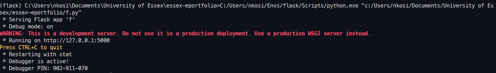

## Introduction to Operating Systems
<br>

### What is an Ontology?
What do you understand about the ontology that has been presented for your reading this week? Could you attempt to define an ontology that would be relevant to the system that you are designing for the summative assessment?

### Answer:
What I understood from this weeks reading on ontology is that the presented ontology focuses on service-oriented architecture (SOA) and its relevance during the development phase, remaining independent of the implementation details.

An Ontology that would be relevant for the reporting system we are designing would be "The Dutch Forensics Incident Reporting Ontology." This ontology would define the concepts, relationships, and properties related to cybersecurity incidents and their reporting process. It would include entities such as "Report," "Flaw," "User Roles," "Incident Type," "Severity," "Affected Systems," "Evidence," and "Handling Procedures." The ontology would capture the essential elements and their interconnections within the context of reporting and managing ICT system flaws, enabling better understanding, interoperability, and integration of the system components and data related to cybersecurity incidents.

### Developing an API for a Distributed Environment
```py
from flask import Flask
from flask_restful import Api, Resource, reqparse
 
app = Flask(__name__)
api = Api(app)
 
users = [
    {
        "name": "James",
        "age": 30,
        "occupation": "Network Engineer"
    },
    {
        "name": "Ann",
        "age": 32,
        "occupation": "Doctor"
    },
    {
        "name": "Jason",
        "age": 22,
        "occupation": "Web Developer"
    }
]
 
class User(Resource):
    def get(self, name):
        for user in users:
            if(name == user["name"]):
                return user, 200
        return "User not found", 404
 
    def post(self, name):
        parser = reqparse.RequestParser()
        parser.add_argument("age")
        parser.add_argument("occupation")
        args = parser.parse_args()
 
        for user in users:
            if(name == user["name"]):
                return "User with name {} already exists".format(name), 400
 
        user = {
            "name": name,
            "age": args["age"],
            "occupation": args["occupation"]
        }
        users.append(user)
        return user, 201
 
    def put(self, name):
        parser = reqparse.RequestParser()
        parser.add_argument("age")
        parser.add_argument("occupation")
        args = parser.parse_args()
 
        for user in users:
            if(name == user["name"]):
                user["age"] = args["age"]
                user["occupation"] = args["occupation"]
                return user, 200
        
        user = {
            "name": name,
            "age": args["age"],
            "occupation": args["occupation"]
        }
        users.append(user)
        return user, 201
 
    def delete(self, name):
        global users
        users = [user for user in users if user["name"] != name]
        return "{} is deleted.".format(name), 200
      
api.add_resource(User, "/user/<string:name>")
 
app.run(debug=True)
```

#### Question 1
Run the API.py code. Take a screenshot of the terminal output. What command did you use to compile and run the code?  

#### Answer
The command used was `python {filename}.py`


#### Question 2
Run the following command at the terminal prompt: w3m http://127.0.0.1:5000/user/Ann

What happens when this command is run, and why?

#### Answer
The following JSON response is returned to us. 
```json
{
  "name": "Ann",
  "age": 32,
  "occupation": "Doctor"
}
Status: 200
```
This is because in the API code, the get request function takes a parameter of `user`, this is the `user.name` contained within the `users` array of objects. 
If a `user.name` matches, a response with their details `user.age` and `user.occupation` gets returned to us.
#### Question 3
Run the following command at the terminal prompt: w3m http://127.0.0.1:5000/user/Adam

What happens when this command is run, and why?

#### Answer
The following JSON response is returned to us. 
```json
"User not found",
Status: 404
```
This is because an object with the `user.name` Adam does not exist in the array of objects `users`
#### Question 4
What capability is achieved by the flask library?

#### Answer
The Flask Library provides a suite of tools for one to build either full applications or just Restful API's like in the above example. 
This API could then be extended to be used as the backend for your application while your frontend is another Framework.