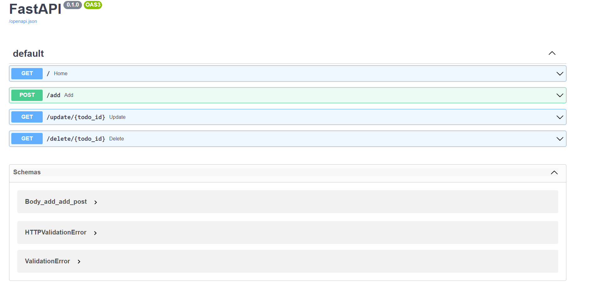

## Developing an API for a Distributed Environment

I tried out one of Pythons libraries called FastAPI to create a simple todolist API with basic CRUD functionality. 
Although for the Summative assessment we will be utilizing Django, I wanted to play around with something new.   
View Project here: [test-fastapi](https://github.com/nkosi-tauro/test-fastapi)

### Snippets  

**/add route**
```py
@app.post("/add")
def add(request: Request, title: str = Form(...), db: Session = Depends(get_db)):
    new_todo = models.Todo(title=title)
    db.add(new_todo)
    db.commit()

    url = app.url_path_for("home")
    return RedirectResponse(url=url, status_code=status.HTTP_303_SEE_OTHER)
```

**/update route**
```py
@app.get("/update/{todo_id}")
def update(request: Request, todo_id: int, db: Session = Depends(get_db)):
    todo = db.query(models.Todo).filter(models.Todo.id == todo_id).first()
    todo.complete = not todo.complete
    db.commit()

    url = app.url_path_for("home")
    return RedirectResponse(url=url, status_code=status.HTTP_302_FOUND)
```


**/delete route**
```py
@app.get("/delete/{todo_id}")
def delete(request: Request, todo_id: int, db: Session = Depends(get_db)):
    todo = db.query(models.Todo).filter(models.Todo.id == todo_id).first()
    db.delete(todo)
    db.commit()

    url = app.url_path_for("home")
    return RedirectResponse(url=url, status_code=status.HTTP_302_FOUND)
```

**Swagger Docs**  


